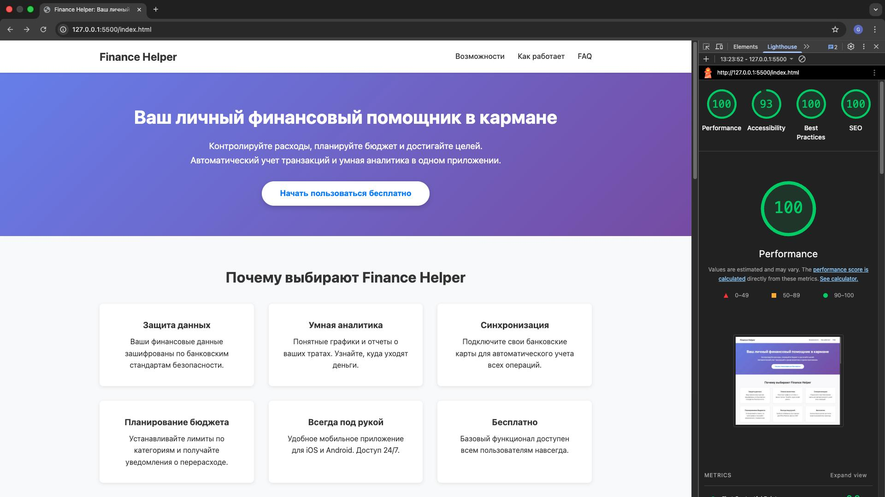

# Finance Helper Landing Page


**Vercel Demo:** [https://finance-landing-eight.vercel.app/](https://finance-landing-eight.vercel.app/)



## Содержание
- [Возможности](#возможности)
- [Как запустить локально](#как-запустить-локально)
- [Как задеплоить](#как-задеплоить)
- [Соответствие Google Ads](#соответствие-google-ads)
- [Техническая реализация формы и событий](#техническая-реализация-формы-и-событий)

## Возможности
- HTML/CSS/JS без тяжелых библиотек.
- Мета-теги, OpenGraph, Canonical URL.
- Полностью адаптивный дизайн.
- Политика конфиденциальности, Условия использования и дисклеймеры.
- Интеграция с Google Tag Manager / dataLayer.

## Как запустить локально
Проект является статическим, поэтому для запуска достаточно любого локального сервера.

### Вариант 1: VS Code Live Server
Если вы используете VS Code, установите расширение **Live Server** и нажмите "Go Live".

### Вариант 3: Python
```bash
python3 -m http.server 8000
```
После запуска откройте `http://localhost:8000`.

## Как задеплоить

### Vercel (рекомендуется)
1. Установите Vercel CLI: `npm i -g vercel`.
2. Запустите команду `vercel` в корне проекта.
3. Следуйте инструкциям. Проект подхватит настройки из `vercel.json` (редиректы для /privacy и /terms).

### GitHub Pages
1. Создайте новый репозиторий на GitHub.
2. Загрузите файлы:
   ```bash
   git init
   git add .
   git commit -m "Initial commit"
   git remote add origin YOUR_REPO_URL
   git push -u origin main
   ```
3. В настройках репозитория (Settings -> Pages) выберите ветку `main`.

### Netlify
1. Перетащите папку с проектом в окно Netlify Drop.
2. Или подключите GitHub репозиторий для автоматического деплоя.

## Соответствие Google Ads
Для успешного прохождения модерации в Google Ads были реализованы следующие решения:
- **Прозрачность:** Наличие четких юридических страниц (Privacy Policy, Terms of Service).
- **Дисклеймеры:** В футере добавлен юридический отказ от ответственности о том, что сервис носит справочный характер.
- **Отсутствие обмана:** Нет обещаний "гарантированного дохода" или "быстрого обогащения". Контент сфокусирован на инструменте учета.
- **Безопасность:** Указано использование HTTPS и соблюдение GDPR.
- **Контактные данные:** Добавлена ссылка на поддержку (Email).

## Техническая реализация формы и событий

### Обработка SubID
Реализована функция `initSubid()`, которая:
- Извлекает `subid` из URL-параметров.
- Сохраняет его в `localStorage` и `sessionStorage` для сохранения контекста при переходах.
- Автоматически заполняет скрытое поле формы.

### События dataLayer
Интегрированы стандартные события для аналитики:
- `cta_click`: Срабатывает при клике на главную кнопку.
- `lead_submit`: Срабатывает при успешной отправке формы, отправляя данные пользователя (name, email) и `subid`.

### Postback Logic
После успешной отправки формы вызывается функция `sendPostback()`, которая отправляет GET-запрос на трекинговый домен:
- Собирает данные: `subid`, `status`, `domain`, а также `gclid`/`fbclid` из URL.
- Использует `fetch` с параметром `keepalive: true` и режимом `no-cors` для надежной отправки "fire-and-forget" даже при закрытии страницы.
